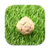
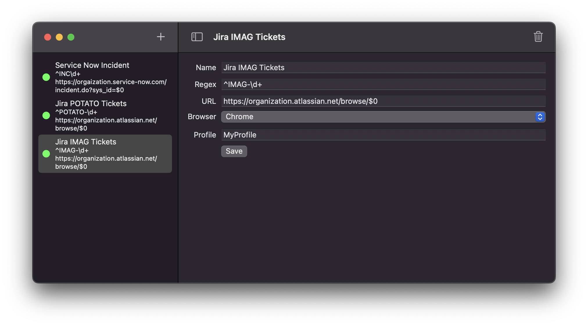

#  Linkma

Create regex and browser rules for your clipboard, allowing you to automatically create and open URLs from your most often copied strings.

* Useful when working with Jira ticket numbers. Copying the string `TICKET-1234` can automatically open `https://your-organization.atlassian.net/browse/TICKET-1234`
* Minimal interruption
  * By default Ligma presents a notification when a pattern is matched. Clicking that notification will open the link in your specified browser.
  * Holding shift *after* copying a matching string will automatically open the generated link in your specified browser.
  * Linkma lives as a minimal icon in your toolbar.
* Browser customization
  * Specify what browser you want to open a specific match with
  * Add your desired browser profile to open your link in (only in supported browsers).

